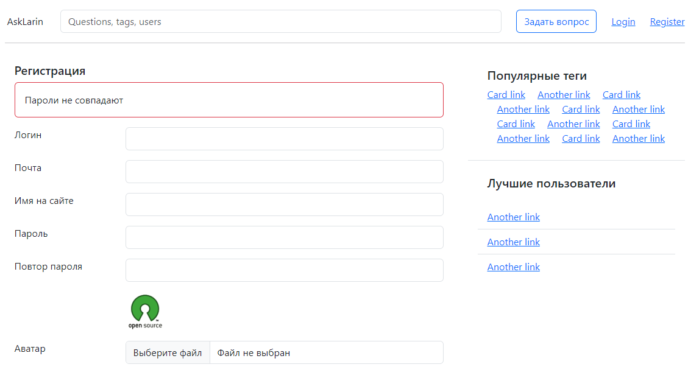
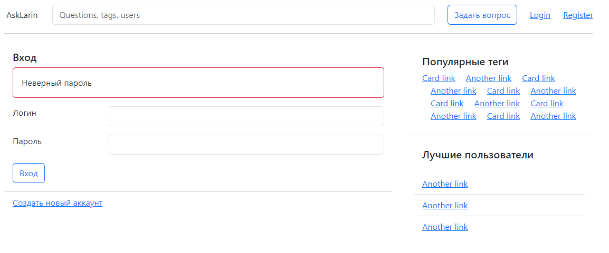

Домашняя работа №1
==================

## Верстка статического сайта
Целью домашнего задания является подготовка статический верстки сайта (так называемой «рыбы»). Верстку можно размещать в обычных html файлах, в директории public.

Скриншоты
---

**Максимальные баллы за ДЗ - 16 баллов**

Верстка общего вида (layout) страницы - 4:
---

- [x] общий вид: 2 колонки, header, footer - 1;
- [x] правая колонка - 1;
- [x] блок авторизованного юзера - 1;
- [x] поисковая строка и логотип - 1.

Верстка листинга вопросов - 3:
---

- [X] общий вид (паддинги, аватарка) - 1;
- [X] кнопки лайков - 1;
- [X] теги, счетчики ответов, остальное - 1.

Верстка страницы вопроса - 3:
---

- [X] общий вид - 1;
- [X] чекбокс “правильный ответ”, кнопки лайков - 1;
- [X] форма ответа - 1.

Верстка формы добавления вопроса - 3:
--

- [X] общий вид - 2;
- [X] сообщения об ошибках - 1.

Верстка форм логина и регистрации - 3:
---

- [X] общий вид - 2;
- [X] аватарка и сообщения об ошибках - 1.

Настройки
---

Страница с тегом
---
