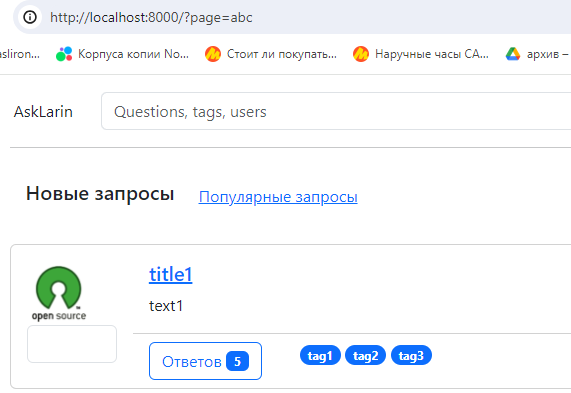
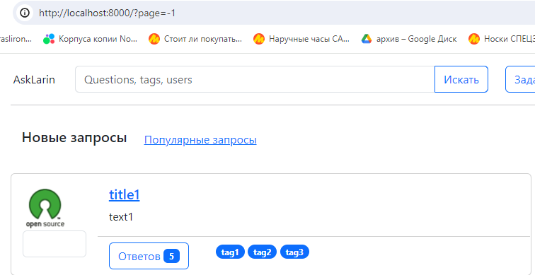

Домашнее задание 2
====

Обработка HTTP запросов
----
Целью домашнего задания является:

- создание основных view сайта (отображающих “рыбу”);
- настройка маршрутизации URL;
- использование шаблонизатора для генерации HTML;
- постраничное отображение (пагинация).


Баллы
---

**Максимальные баллы за ДЗ - 14 баллов**

Создать views и шаблоны для основных страниц - 6
---
[Файл views](./ask_larin/ask/views.py)

- [X] главная (список новых вопросов) - 1;
  
  [Файл](./ask_larin/templates/index.html)

  Декомпозиция шаблонов:

  - [Карточка вопросов](./ask_larin/templates/catalog_card.html)
  - [Пагинация](./ask_larin/templates/paginator.html)
  - [Базовый файл](./ask_larin/templates/base.html)
  
- [X] страница вопроса (список ответов) - 1;
  
  [Файл](./ask_larin/templates/question.html)

  Декомпозиция шаблонов:

  - [Карточка вопроса](./ask_larin/templates/question_card.html)
  - [Карточка ответа](./ask_larin/templates/answer_card.html)
  - [Базовый файл](./ask_larin/templates/base.html)

- [X] страница добавления вопроса - 1;

  [Файл](./ask_larin/templates/new_question.html)

  Декомпозиция шаблонов:

  - [Базовый файл](./ask_larin/templates/base.html)

- [X] форма регистрации - 1;

  [Файл](./ask_larin/templates/register.html)

  Декомпозиция шаблонов:

  - [Базовый файл](./ask_larin/templates/base.html)
  
- [X] форма входа - 1;
  
  [Файл](./ask_larin/templates/login.html)

  Декомпозиция шаблонов:

  - [Базовый файл](./ask_larin/templates/base.html)
  
- [X] форма редактирования профиля - 1.
  
  [Файл](./ask_larin/templates/setting.html)

  Декомпозиция шаблонов:

  - [Базовый файл](./ask_larin/templates/base.html)


Создать urls.py для всех страниц - 4:
---

- [X] Собственно urls.py - 2;
  
``` python
from django.contrib import admin
from django.urls import path
from ask import views

urlpatterns = [
    path('admin/', admin.site.urls),
    path('', views.questions_catalog, name='questions'),
    path('hot', views.hot_questions_catalog, name='hot'),
    path('tag/<str:tag>', views.tag, name='tag'),
    path('<int:id>', views.question, name='question'),
    path('login', views.login, name='login'),
    path('register', views.register, name='register'),
    path('settings', views.settings, name='settings'),
    path('new_question', views.new_question, name='new_question')
]
```
- [X] Именованные маршруты (во всех шаблонах) - 2.
  
  base.html
  ``` html
    
    <div class="col-auto">
       
       Dr Peper
    </div>
    <div class="col-auto">
      <a href=>Settings</a>
    </div>
    <div class="col-auto">
       <a href=>Logout</a>
    </div>
    
    <div class="col-auto">
      <a href=>Login</a>
    </div>
    <div class="col-auto">
      <a href=>Register</a>
    </div>
    
  ```

  catalog_card.html
  ```html
    <div class="card-body">
      <h5 class="card-title"><a href=>{{data.question.title}}</a></h5>
      <p class="card-text">{{data.question.text}}</p>
    </div>
    <div class="card-footer">
       <div class="row">
          <div class="col-md-3">
             <a href= class="btn btn-outline-primary">
               Ответов <span class="badge text-bg-primary">{{data.answers_amount}}</span>
             </a>
          </div>
          <div class="col-md-9">
             
             <span class="badge rounded-pill text-bg-primary"><a href= class="tag">{{tag}}</a></span>
             
          </div>
       </div>
    </div>
  ```


Постраничное отображение - 4:
---

- [X] функция пагинации - 1;
```python
def paginate(objects_list, request, per_page=10):
    p = Paginator(objects_list, 10)
    try:
        number = int(request.GET.get("page", 1))
        if number > p.num_pages + 1 or number < 1:
            raise Exception()
        current_page = p.get_page(number)
    except:
        number = 1
        current_page = p.get_page(number)
    result = {
            "has_previous": False,
            "has_next": False,
    }
    result["page"] = current_page
    result["current_page"] = current_page.number
    if current_page.has_previous() == True:
        result["has_previous"] = True
        result["previous_page"] = current_page.previous_page_number()
    if current_page.has_next() == True:
        result["has_next"] = True
        result["next_page"] = current_page.next_page_number()
    return result
```
- [X] шаблон для отрисовки пагинатора - 2;
  
  [Файл](./ask_larin/templates/paginator.html)

- [X] корректная обработка “неправильных” параметров - 1.
  
  

  

