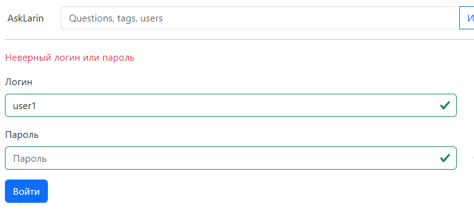
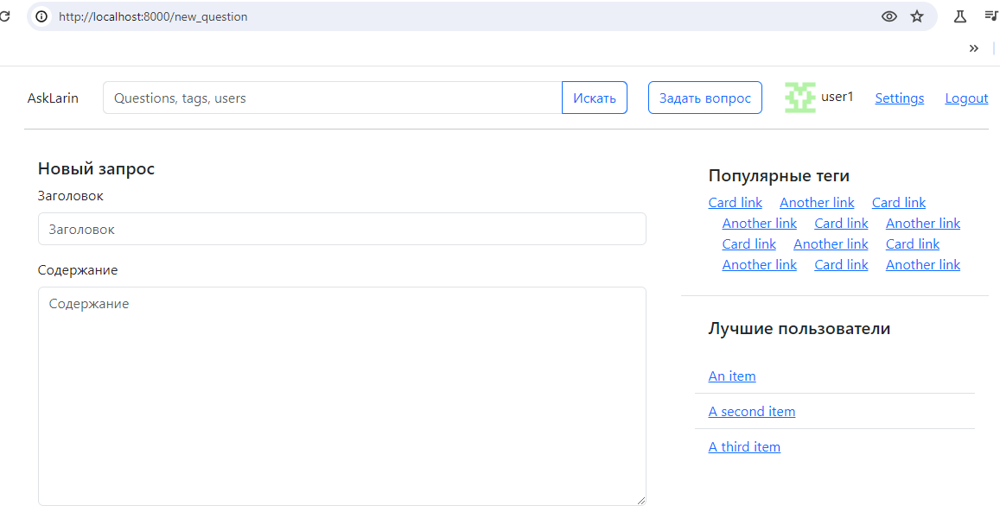
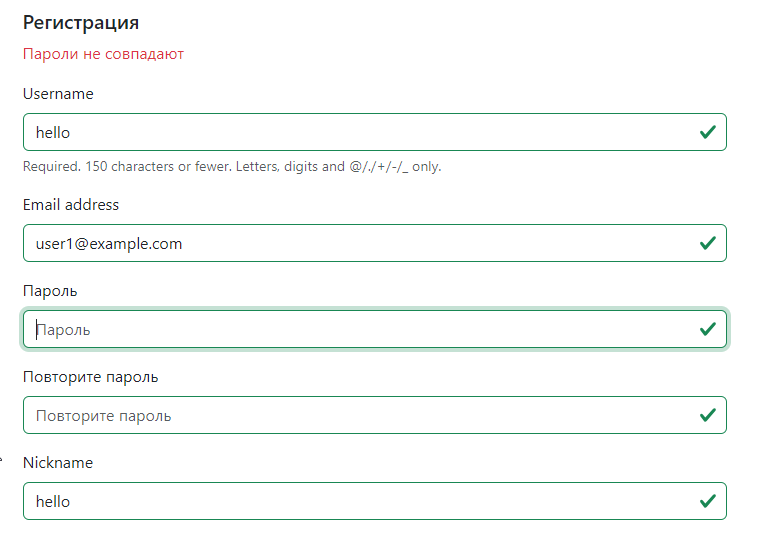
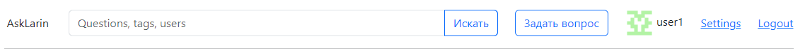
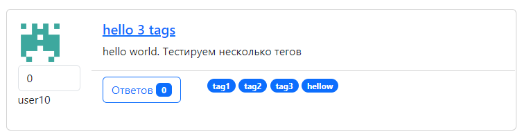
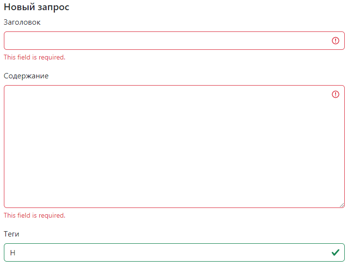
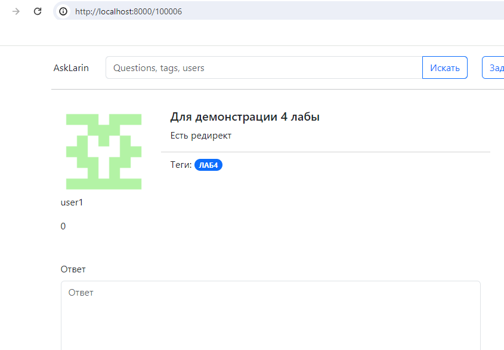
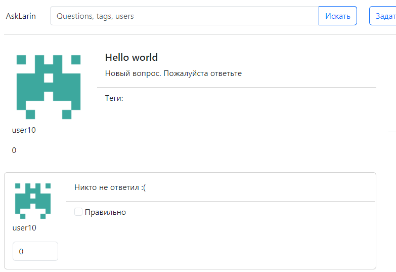

Вход на сайт - 3:

Код формы:

```python
class LoginForm(forms.Form):
    username = forms.CharField(label="Логин", max_length=128)
    password = forms.CharField(label="Пароль", widget=forms.PasswordInput)

    def clean_username(self):
        return self.cleaned_data['username'].lower().strip()
```

Код обработки

```python
def login(request):
    next_url = request.GET.get('next', reverse('questions'))
    form = LoginForm()
    if request.method == 'POST':
        form = LoginForm(request.POST)
        if form.is_valid():
            user = auth.authenticate(request, **form.cleaned_data)
            if user:
                auth.login(request, user)
                return redirect(next_url)
            else:
                form.add_error(None, 'Неверный логин или пароль')
    return render(request, 'login.html', {
        'form': form,
        'next_url': next_url
    })
```

Как учитываю next_url

```html
<form action="?next={{ next_url }}" method="POST" class="form">
    

    

    
</form>
```

- [x] общее - 1;
- [x] возврат на исходную страницу - 1;
  
  

- [x] отображение ошибок - 1.
  
  

  

Регистрация на сайте - 3:

Код формы

```python
class RegisterForm(forms.ModelForm):
    password = forms.CharField(label="Пароль", widget=forms.PasswordInput)
    check_password = forms.CharField(label="Повторите пароль", widget=forms.PasswordInput)
    nickname = forms.CharField()
    avatar = forms.ImageField(required=False)

    class Meta:
        model = User
        fields = ("username", "email", "password")

    def clean(self):
        cleaned_data = super().clean()
        password = cleaned_data.get("password")
        check_password = cleaned_data.get("check_password")
        email = cleaned_data.get("email")
        username = cleaned_data.get("username")
        nickname = cleaned_data.get("nickname")
        if nickname == None or nickname.strip() == '':
            cleaned_data["nickname"] = username
        if password and check_password and password != check_password:
            raise forms.ValidationError("Пароли не совпадают")
        if User.objects.filter(email=email).exists():
            raise forms.ValidationError("Этот email уже зарегистрирован")
        if User.objects.filter(username=username).exists():
            raise forms.ValidationError("Этот логин уже зарегистрирован")
        return cleaned_data
    
    def save(self, commit=True):
        user = super().save(commit=False)
        user.set_password(self.cleaned_data['password'])

        if commit:
            user.save()
        
        profile = Profile(user=user, nickname=self.cleaned_data['nickname'])
        if 'avatar' in self.cleaned_data:
            profile.image = self.cleaned_data['avatar']
        profile.save()
```

Код обработчика

```python
def register(request):
    form = RegisterForm()
    if request.method == 'POST':
        form = RegisterForm(request.POST, request.FILES)
        if form.is_valid():
            user = form.save()
            user = auth.authenticate(request, **form.cleaned_data)
            if user is not None:
                auth.login(request, user)
                return redirect(reverse('questions'))
    return render(request, 'register.html', {'form': form})
```

- [x] общее - 2;
- [x] отображение ошибок - 1.
  
  

Выход с сайта - 1:

- [x] Отображение текущего пользователя в шапке - 1.
  
  

Добавление вопроса - 4:

код формы

```python
class QuestionForm(forms.ModelForm):
    tags = forms.CharField(label="Теги", max_length=128)
    
    def clean_tags(self):
        tags = self.cleaned_data['tags'].split(',')
        result = []
        for i in tags:
            if i.strip() != '':
                result.append(i.strip())
        return result
    
    def clean_title(self):
        title = self.cleaned_data.get('title').strip()
        
        if title == '':
            raise forms.ValidationError('Пустое поле заголовка вопроса')
        return title
    
    def clean_description(self):
        description = self.cleaned_data.get('description').strip()
        
        if description == '':
            raise forms.ValidationError('Пустое поле вопроса')
        return description

    def save(self, profile):
        title = self.cleaned_data['title']
        description = self.cleaned_data['description']
        tags = self.cleaned_data['tags']

        for i in range(len(tags)):
            tags[i], created = Tag.objects.get_or_create(name=tags[i])
        
        question = Question(
            title=title,
            description=description,
            profile=profile,
        )
        question.save() # как оказалось нужно для добавления тегов
        question.tags.set(tags)
        question.save()

        return question
    
    class Meta:
        model = Question
        fields = ("title", "description", "tags")
```

```python
@login_required(login_url='login')
def new_question(request):
    form = QuestionForm()
    if request.method == 'POST':
        form = QuestionForm(request.POST)
        if form.is_valid():
            profile = Profile.objects.get(user=request.user)
            question = form.save(profile=profile)
            return redirect('question',question.id)
    return render(request, 'new_question.html', {'form': form})
```

- [x] общее - 1;
- [x] добавление тегов - 1;
  
  

- [x] отображение ошибок - 1;
  
  

- [x]редирект на страницу вопроса - 1.
  
  

  В коде

  ```python
  return redirect('question',question.id)
  ```

Добавление ответа - 2:

- [x] общее - 1;
  
  Он работает

  
- редирект на добавленный ответ - 1.

Проверка метода запроса 1. **?????**


