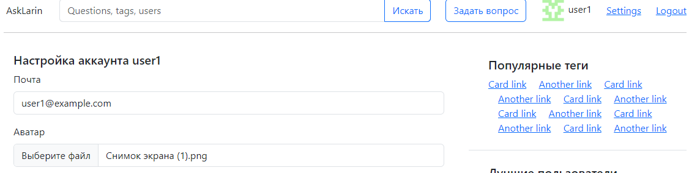
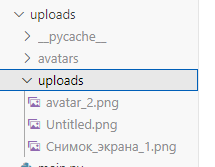
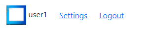
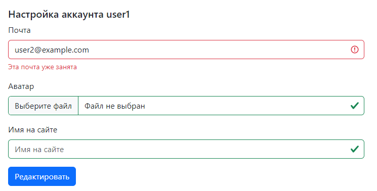
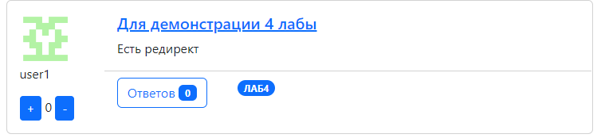
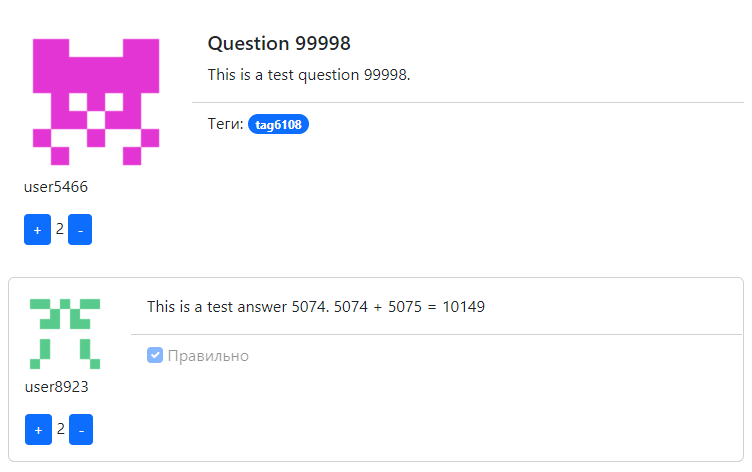
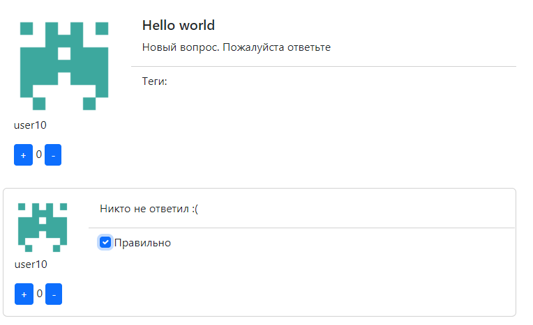

# Домашнее задание 5

#### Максимальные баллы за ДЗ - 11 баллов

Загрузка и отображение аватарок пользователей - 4:




- [x] заливка картинок в uploads - 2;
  
  

- [x] отображение картинок из uploads - 2.
  
  

Страница редактирования профиля - 2:

код формы

```python
class SettingsForm(forms.ModelForm):
    avatar = forms.ImageField(label='Аватар', required=False)
    nickname = forms.CharField(label='Имя на сайте', required=False)
    email = forms.EmailField(label='Почта')

    def clean(self):
        data = super().clean()

        current_email = self.instance.email
        new_email = data.get('email')

        if new_email != current_email and User.objects.filter(email=new_email).exists():
            self.add_error('email', 'Эта почта уже занята')

        return data

    def save(self, commit=True):
        print(self.cleaned_data)
        user = super().save(commit=False)
        
        if commit:
            user.save()

        if 'avatar' in self.cleaned_data and self.cleaned_data['avatar'] != None:
            profile = Profile.objects.get(user=user)
            profile.image = self.cleaned_data['avatar']
            profile.save()
        
        if 'nickname' in self.cleaned_data and self.cleaned_data['nickname'] != None:
            profile = Profile.objects.get(user=user)
            profile.nickname = self.cleaned_data['nickname']
            profile.save()

        return user
    
    class Meta:
        model = User
        fields = ('email',)
```

```python
@login_required(login_url='login')
def settings(request):
    form = SettingsForm(instance=request.user)
    if request.method == 'POST':
        form = SettingsForm(request.POST, request.FILES, instance=request.user)
        if form.is_valid():
            user = form.save()  
    return render(request, 'setting.html', {'form': form})
```

- [x] общее - 1;
- [x] отображение ошибок - 1.
  
  

Лайки вопросов и ответов - 2:
```javascript
likeButton.addEventListener('click', async (event) => {
        const response = await fetch(`/answer_like/${id}`, {
            method: 'POST',
            headers: {
                'X-CSRFToken': csrftoken,
                'Content-Type': 'application/json'
            },
            body: '{ "rating": 1 }'
        });

        if (response.ok) {
            const data = await response.json();
            rating.textContent = data.rating;
        }
    });

    dislikeButton.addEventListener('click', async (event) => {
        const response = await fetch(`/answer_like/${id}`, {
            method: 'POST',
            headers: {
                'X-CSRFToken': csrftoken,
                'Content-Type': 'application/json'
            },
            body: '{ "rating": -1 }'
        });

        if (response.ok) {
            const data = await response.json();
            rating.textContent = data.rating;
        }
    });
```

аналогично для вопросов

```python
def question_like(request, id):
    try:
        data = json.loads(request.body)
    except:
        return JsonResponse({"error": "Invalid JSON"}, status=400)
    user = request.user
    if user == None:
        return JsonResponse({"error": "No auth"}, status=400)
    rating = QuestionLike.objects.like(id, user, data["rating"])
    return JsonResponse({"rating" : rating})
```

- [x] общее - 1;
  
  

- [x] AJAX - 1.

Отметка “правильный ответ” - 2:

```html

            <div class="card-footer">
                
                <input class="form-check-input find-checkbox" type="checkbox" id="correct1" checked>
                
                <input class="form-check-input find-checkbox" type="checkbox" id="correct1">
                
                <label class="form-check-label" for="correct1">
                    Правильно
                </label>
            </div>
            
            <div class="card-footer">
                
                <input class="form-check-input" type="checkbox" id="correct1" checked disabled>
                
                <input class="form-check-input" type="checkbox" id="correct1" disabled>
                
                <label class="form-check-label" for="correct1">
                    Правильно
                </label>
            </div>
            
```

```python
def correct_answer(request, id):
    user = request.user
    answer = Answer.objects.get(id=id)
    creator = answer.question.profile.user
    if user != creator:
        return JsonResponse({"error": "No question author"}, status=400)
    answer.correct = not answer.correct
    answer.save()
    return JsonResponse({"status": "OK"}, status=200)
```

- [x] общее - 1;
  
  зашёл за юзера user10

  нельзя нажать на чекбокс если не автор вопроса

  

  можно нажать если автор вопроса
  
  
- [x] AJAX - 1.
  
```javascript
checkbox.addEventListener('click', async (event) => {
        const response = await fetch(`/answer_correct/${id}`, {
            method: 'POST',
            headers: {
                'X-CSRFToken': csrftoken,
                'Content-Type': 'application/json'
            }
        });
    
        if (response.ok) {
            return;
        }
    });
```

Проверка авторизации, csrf, метода запроса, авторства - 1.
